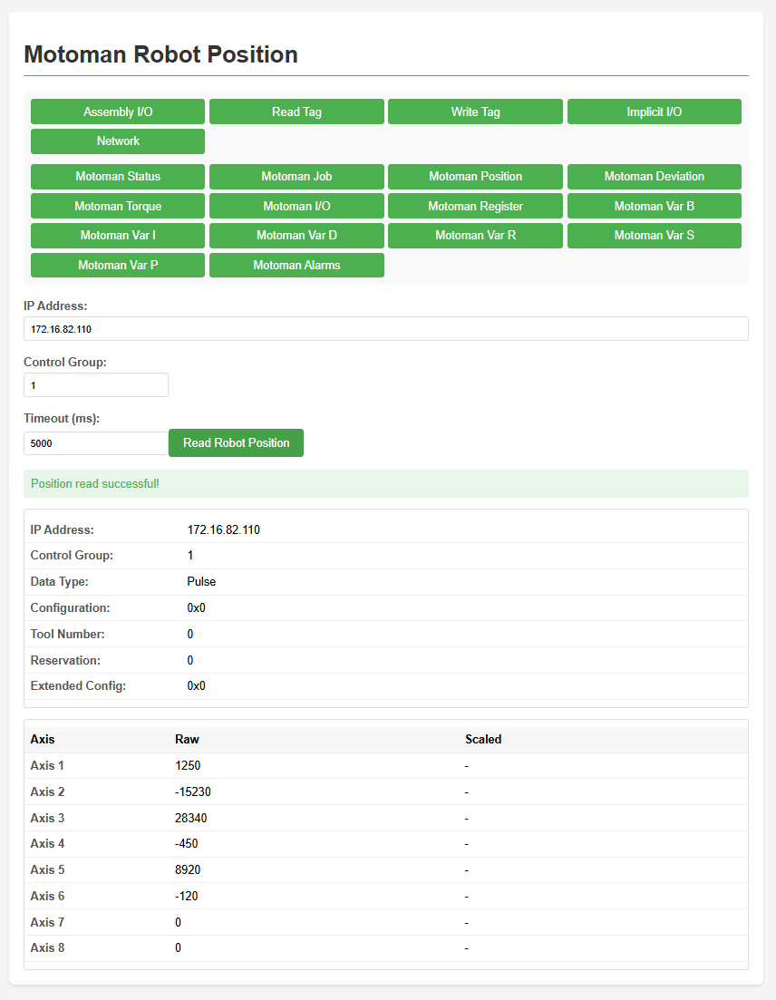
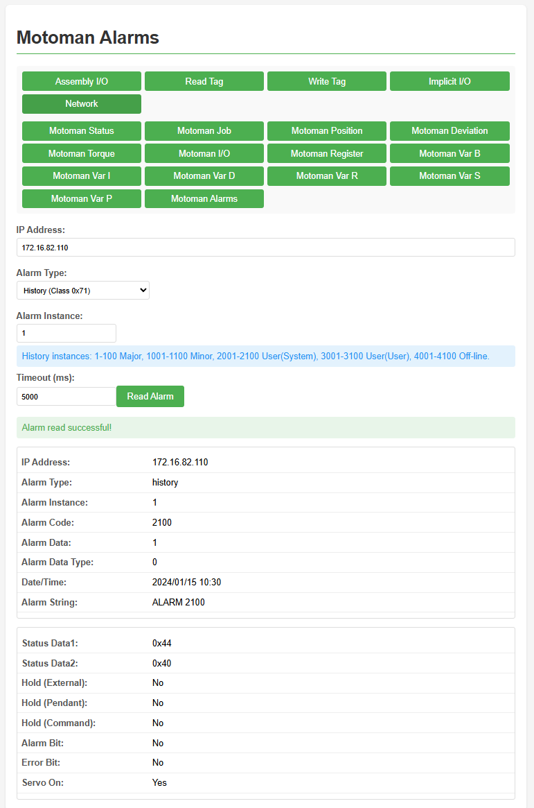

# Usage Examples

This document provides visual examples of using the Motoman DX200 Simulator with EtherNet/IP scanner tools.

## Reading Robot Data

The simulator supports reading various types of robot data through EtherNet/IP (CIP) protocol. Below are examples of reading different data types using EtherNet/IP Explorer or similar tools.

### Reading Robot Position

The Robot Position class (Class 0x75, Decimal 117) provides access to robot position data in pulse values. Each instance represents a different position register.

**Description**: This screenshot shows a `Get_Attribute_Single` request to read robot position data from Class 0x75 (MotomanPosition). The response includes pulse values for all 6 robot axes (J1-J6), representing the current robot position in encoder pulses.

**Key Details**:
- **Class**: 0x75 (117 decimal) - MotomanPosition
- **Instance**: Typically 1-100 for different position registers
- **Attributes**: 
  - Attribute 1: J1 pulse value
  - Attribute 2: J2 pulse value
  - Attribute 3: J3 pulse value
  - Attribute 4: J4 pulse value
  - Attribute 5: J5 pulse value
  - Attribute 6: J6 pulse value

### Reading Robot Position Variables

Position Variables (Class 0x7F, Decimal 127) store robot positions in a structured format, including pulse values and configuration flags.

**Description**: This example demonstrates reading a Position Variable (P-variable) from the simulator. Position variables contain complete position information including all axis pulses and position type flags (Cartesian vs. Joint, Tool/User frame settings, etc.).

**Key Details**:
- **Class**: 0x7F (127 decimal) - MotomanVariableP
- **Instance**: 1-1000 for different position variable registers
- **Attributes**: Multiple attributes containing pulse values, position type, tool number, user frame number, and other configuration data

### Reading Robot Alarm History

The Alarm History class (Class 0x71, Decimal 113) provides access to historical alarm information stored in the robot controller.

**Description**: This screenshot shows reading alarm history data from the simulator. The alarm history contains information about past alarms including alarm codes, timestamps, and alarm descriptions.

**Key Details**:
- **Class**: 0x71 (113 decimal) - MotomanAlarmHistory
- **Instance**: Typically 1-100 for different alarm history entries
- **Attributes**: 
  - Alarm code
  - Alarm timestamp
  - Alarm description
  - Alarm severity level

## Using EtherNet/IP Explorer

To use these examples with EtherNet/IP Explorer:

1. **Connect to the Simulator**:
   - Enter the simulator's IP address in EtherNet/IP Explorer
   - The device should appear with Vendor ID 44 (Yaskawa) and Product Code 1281

2. **Navigate to Motoman Classes**:
   - Expand the device connection
   - Browse to the vendor-specific classes (0x70-0x81, 0x8C in hex, or 112-140 in decimal)

3. **Read Attributes**:
   - Select the desired class and instance
   - Use `Get_Attribute_Single` to read individual attributes
   - Use `Get_Attribute_All` to read all attributes at once (if supported by the class)

4. **Interpret Results**:
   - Compare the returned values with the [Pre-Initialized Data Reference](PREINITIALIZED_DATA_REFERENCE.md)
   - Verify that the data matches expected robot controller behavior

## Common Operations

### Reading Multiple Instances

Many classes support multiple instances (e.g., Position Variables P1-P1000). To read different instances:

1. Change the instance number in your CIP request
2. Each instance contains independent data
3. Instance 0 typically contains class-level information

### Reading All Attributes

Some classes support `Get_Attribute_All` which reads all attributes in a single request:

- More efficient than multiple `Get_Attribute_Single` requests
- Returns all attribute values in one response
- Check the class documentation to see if this is supported

### Error Handling

If you receive an error response:

- **Service Not Supported (0x08)**: The requested service is not implemented for this class/attribute
- **Attribute Not Supported (0x14)**: The attribute number is invalid
- **Instance Does Not Exist (0x15)**: The instance number is out of range
- **Invalid Attribute Value (0x13)**: The attribute value is invalid (for Set operations)

## Testing Tips

1. **Start with Simple Reads**: Begin by reading basic status information (Class 0x72 - MotomanStatus)

2. **Verify Pre-Initialized Data**: Compare your results with the pre-initialized values documented in [Pre-Initialized Data Reference](PREINITIALIZED_DATA_REFERENCE.md)

3. **Test Multiple Instances**: Try reading different instances to verify the simulator handles instance numbers correctly

4. **Check Data Types**: Verify that the data types match the expected format (INT, DINT, REAL, etc.)

5. **Monitor Serial Output**: Use the serial monitor to see debug messages from the simulator during CIP operations

For more detailed information about CIP classes and their attributes, see:
- [CIP Classes Reference](CIP_CLASSES_REFERENCE.md)
- [CIP Classes Decimal Reference](CIP_CLASSES_DECIMAL_REFERENCE.md)

